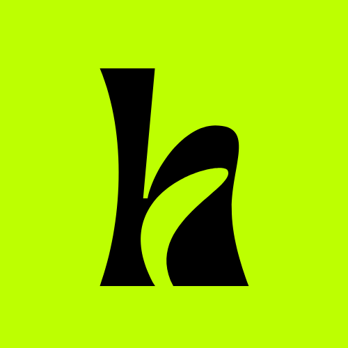

<h1 align="center">
   <br>
   <a href="https://bobthebot.netlify.app/">
    
   </a>
   <br>
   <a href="https://instagram.com/dragshorts/">Half as History</a><br>
</h1>

<h4 align="center">
    A simple bot which share the events, that happened years ago, but this day! <a href="https://twitter.com/halfashistory">click here</a> 
</h4>

<br>

## Platforms

-   [x] Twitter
-   [ ] Instagram
-   [ ] Facebook

## Create Post

-   Category : `events` | `births` | `deaths`
-   Platform : `twitter` (only one as of now)

```
GET /post/<category>/<platform>
```
